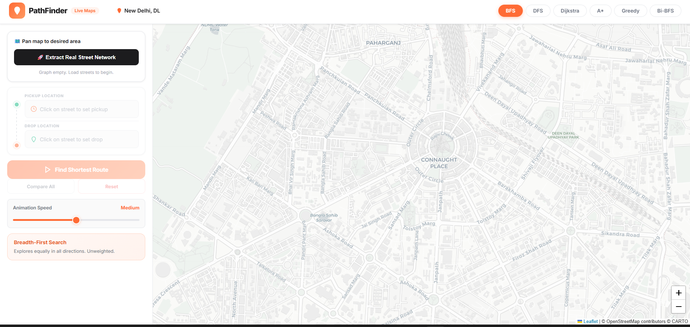

# 🗺️ PathFinder — Real-World Pathfinding Visualizer

> An interactive web application that visualizes classical pathfinding algorithms on live OpenStreetMap data, helping users understand algorithmic efficiency through real-world geography.

[](https://opensource.org/licenses/MIT)
[](https://developer.mozilla.org/en-US/docs/Web/JavaScript)
[](https://leafletjs.com/)
[](https://www.openstreetmap.org/)

## 📸 Screenshots


*Interactive map interface with algorithm selection and real-time visualization*

## ✨ Features

- **Real-World Data**: Integrates with OpenStreetMap to visualize algorithms on actual city streets
- **Multiple Algorithms**: Supports BFS, DFS, Dijkstra, A*, Greedy Best-First, and Bidirectional BFS
- **Interactive UI**: Click-to-set pickup and drop-off locations on the map
- **Performance Metrics**: Real-time comparison of algorithm efficiency (time, nodes explored, path length)
- **High-Performance Rendering**: Uses Leaflet Canvas Renderer for smooth animations
- **Responsive Design**: Works seamlessly across desktop and mobile devices

## 🛠️ Tech Stack

- **Frontend**: HTML5, CSS3, JavaScript (ES6+)
- **Mapping**: Leaflet.js for interactive maps
- **Data Source**: OpenStreetMap via Overpass API
- **Styling**: Custom CSS with Inter font family
- **No Build Tools**: Pure client-side application

## 📁 Project Structure

```
PathFinder/
├── index.html      # Main HTML structure and Leaflet map container
├── styles.css      # Complete UI styling and responsive design
├── script.js       # Core logic, algorithms, and map interactions
└── README.md       # Project documentation
```

## 🚀 Installation & Setup

1. **Clone the repository**
   ```bash
   git clone https://github.com/JatinJakhar1/PathFinder.git
   cd PathFinder
   ```

2. **Open in browser**
   - Simply open `index.html` in any modern web browser
   - No server or build process required

3. **Start exploring**
   - Pan and zoom the map to your desired location
   - Click "Extract Real Street Network" to load local roads
   - Set pickup (green) and drop-off (red) points by clicking on streets

## 📖 Usage

1. **Load Map Data**: Pan to your city and click "Extract Real Street Network"
2. **Set Points**: Click on any street intersection to place pickup/drop-off markers
3. **Choose Algorithm**: Select from BFS, DFS, Dijkstra, A*, Greedy, or Bi-BFS
4. **Visualize**: Watch the algorithm explore streets in real-time
5. **Compare**: View performance metrics in the results panel

### Algorithm Explanations
- **BFS**: Explores equally in all directions (unweighted)
- **DFS**: Wanders deeply until dead end (inefficient)
- **Dijkstra**: Always chooses closest intersection by street distance (optimal)
- **A***: Uses spatial heuristics for efficient exploration (optimal)
- **Greedy**: Focuses on geometric proximity to goal (fast, not always optimal)
- **Bi-BFS**: Searches from both ends simultaneously

## 🎯 Demo

[🌐 Live Demo](https://JatinJakhar1.github.io/PathFinder/)

Experience PathFinder in action with pre-loaded city data and interactive examples.

## 🔮 Future Improvements

- [ ] Add more pathfinding algorithms (Bellman-Ford, Floyd-Warshall)
- [ ] Implement traffic-aware routing with real-time data
- [ ] Add waypoint support for multi-stop routes
- [ ] Include elevation data for 3D pathfinding
- [ ] Export routes to GPX/KML formats
- [ ] Add offline map support

## 👤 Author

**Jatin Jakhar**
- GitHub: [@JatinJakhar1](https://github.com/JatinJakhar1)

## 📄 License

This project is licensed under the MIT License - see the [LICENSE](LICENSE) file for details.

---

*Built with ❤️ for algorithm education and real-world application*
- **Find Route**: Runs the selected algorithm step-by-step.
- **Compare All**: Runs all 6 algorithms instantly and ranks them by real performance.

---

## 🧠 Algorithms Implemented

| Algorithm | Type | Complexity | Characteristics |
|---|---|---|---|
| **BFS** (Breadth-First) | Uninformed | `O(V+E)` | Explores layer by layer. Ignores physical distance, only counts intersections. |
| **DFS** (Depth-First) | Uninformed | `O(V+E)` | Extremely inefficient. Wanders blindly down continuous streets until hitting a dead end. |
| **Dijkstra's** | Optimal | `O((V+E)logV)` | Continually selects the closest intersection by actual street distance. Explores outward radially. Guarantees shortest distance. |
| **A* (A-Star)** | Heuristic | `O(E log V)` | Uses spatial intuition (*Haversine distance*) toward the goal. Optimal, but explores far fewer streets than Dijkstra. |
| **Greedy Best-First** | Heuristic | `O(V log V)` | Makes local optimal choices aiming strictly at the goal. Extremely fast, but route is rarely optimal. |
| **Bidirectional BFS**| Optimization | `O(V+E)` | Searches simultaneously from both Pickup and Drop-off, meeting in the middle. Massively reduces search area volume. |

---

## 🎮 How to Use

1. **Open** `index.html` in any modern browser.
2. The map will load centered on New Delhi. Pan or zoom to any neighborhood you like. Note: keep the zoom reasonably close (city-block level) to avoid enormous data downloads.
3. Click the **🚀 Extract Real Street Network** button in the left drawer to pull the local streets covering the visible map.
4. **Click** any gray highlighted street to place the **Pickup Location**.
5. **Click** another highlighted street to place the **Drop Location**.
6. Select a pathfinding **Algorithm** from the top right pills (e.g., A* or Dijkstra).
7. Click **Find Shortest Route** to dispatch the algorithm visually over the real streets.

---

## 📊 Performance Analytics

When evaluating the stats panel, pay close attention to:
- **Dijkstra** will find the perfect route but will explore in a massive, costly circle.
- **A*** will find the *exact same* perfect route but explore a tight visual corridor toward the destination, drastically reducing nodes visited.
- **Greedy** will shoot straight for the destination, sometimes making mistakes in winding suburban grids.

---

*Built for the Design & Analysis of Algorithms (DAA) course — evaluating graph traversals against real-world topological constraints.*
